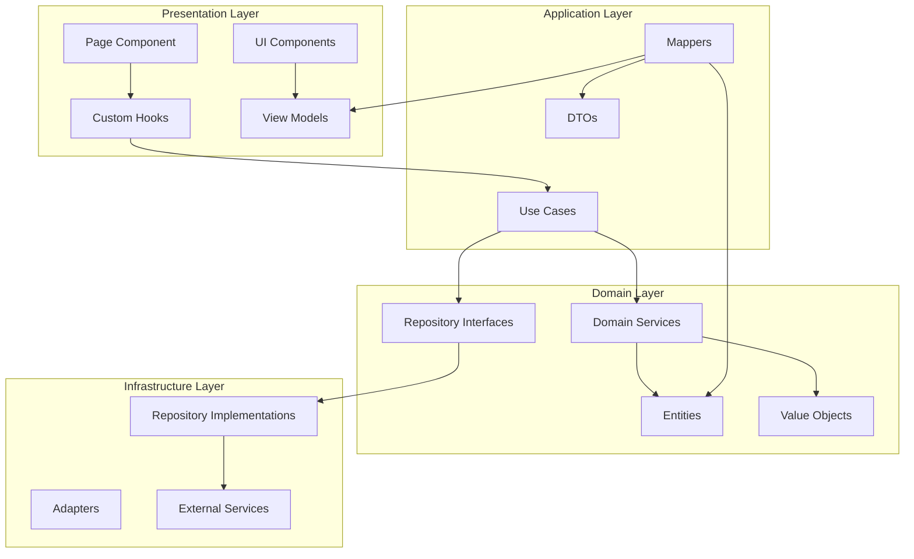

# User Story: [User Story Title]

## Overview

<!-- Provide a brief overview of this user story and what feature it belongs to -->

This user story implements **[feature description]** with **[key capabilities]**.

**Feature Area:** [e.g., File Processing, Data Validation, Export Management]  
**Milestone:** [e.g., v1.2.0, Q1 2026]  
**Priority:** [P0 - Critical / P1 - High / P2 - Medium / P3 - Low]  
**Labels:** `user-story`, `frontend`, `[feature-area]`, `[additional-labels]`

**As a** [user type]  
**I want to** [action/goal]  
**So that** [benefit/value]

**Acceptance Criteria:**
- [ ] [Criterion 1]
- [ ] [Criterion 2]
- [ ] [Criterion 3]
- [ ] [Criterion 4]

**Technical Notes:**
- Component: `[ComponentName]`
- State Management: `[State approach]`
- Side Effects: `[API calls, file operations, etc.]`
- [Additional technical details]

**Implementation Tasks:**

**Domain Layer (Business Logic):**
- [ ] Create `[Entity]` entity (`src/domain/[feature]/entities/[Entity].ts`)
  - Properties: `[property1]`, `[property2]`, `[property3]`
  - Methods: `[validateMethod]()`, `[businessLogicMethod]()`
  - Immutable structure with type safety
- [ ] Create `[ValueObject]` value object (`src/domain/[feature]/value-objects/[ValueObject].ts`)
  - Properties: `[property]`
  - Validation logic
- [ ] Create `[DomainService]` service (`src/domain/[feature]/services/[DomainService].ts`)
  - Business logic: `[method1]()`, `[method2]()`
  - Pure domain operations
- [ ] Create `[Repository]` interface (`src/domain/[feature]/repositories/I[Repository].ts`)
  - Methods: `[findMethod]()`, `[saveMethod]()`, `[deleteMethod]()`
- [ ] Create domain errors (`src/domain/[feature]/errors/[ErrorName].ts`)
  - Error types: `[Error1]`, `[Error2]`

**Application Layer (Use Cases):**
- [ ] Create `[UseCase]` use case (`src/application/[feature]/use-cases/[UseCase].ts`)
  - Orchestrates domain logic
  - Handles application flow
  - Input: `[InputDto]`
  - Output: `Result<[OutputDto], [ErrorType]>`
- [ ] Create `[Dto]` DTO (`src/application/[feature]/dtos/[Dto].ts`)
  - Properties: `[property1]`, `[property2]`
  - Validation schema (Zod/Yup)
- [ ] Create `[Mapper]` mapper (`src/application/[feature]/mappers/[Mapper].ts`)
  - `toDomain()`: DTO → Domain Entity
  - `toDto()`: Domain Entity → DTO
  - `toViewModel()`: Domain Entity → View Model

**Infrastructure Layer (External Concerns):**
- [ ] Create `[Repository]Impl` implementation (`src/infrastructure/[feature]/repositories/[Repository]Impl.ts`)
  - Implements domain repository interface
  - Uses browser APIs (localStorage, IndexedDB, File API)
- [ ] Create `[Service]Impl` implementation (`src/infrastructure/[feature]/services/[Service]Impl.ts`)
  - External service integration
  - API calls, file I/O, etc.
- [ ] Create `[Adapter]` adapter (`src/infrastructure/[feature]/adapters/[Adapter].ts`)
  - Adapts external format to domain format
  - Handles serialization/deserialization

**Presentation Layer (UI Components):**
- [ ] Create `[Feature]Page` page component (`src/presentation/[feature]/pages/[Feature]Page.tsx`)
  - Main page container
  - Route definition
- [ ] Create `[Component]` component (`src/presentation/[feature]/components/[Component].tsx`)
  - UI component with props interface
  - Accessibility attributes (ARIA)
  - Responsive design
- [ ] Create `[Hook]` custom hook (`src/presentation/[feature]/hooks/use[Hook].ts`)
  - Encapsulates component logic
  - Calls use cases
  - Manages local state
- [ ] Create `[ViewModel]` view model (`src/presentation/[feature]/view-models/[ViewModel].ts`)
  - UI-specific data structure
  - Presentation logic
- [ ] Create styles (`src/presentation/[feature]/styles/[Feature].module.css`)
  - Component styles
  - Theme integration

**State Management:**
- [ ] Create `[Feature]Store` state store (`src/presentation/[feature]/store/[Feature]Store.ts`)
  - State shape definition
  - Actions/reducers
  - Selectors
- [ ] Create state hooks (`src/presentation/[feature]/store/hooks.ts`)
  - Typed hooks for state access

**Dependency Injection:**
- [ ] Register dependencies (`src/infrastructure/di/container.ts`)
  - Register repositories
  - Register services
  - Register use cases
- [ ] Create provider (`src/presentation/providers/[Feature]Provider.tsx`)
  - React Context for DI
  - Provide dependencies to components

---

## Related Issues & Dependencies

<!-- Link to related user stories, dependencies, or issues that are part of the same feature -->

- **Related to:** #[issue-number]
- **Part of feature:** #[parent-issue-number] (optional - if using parent issues for feature grouping)
- **Depends on:** #[issue-number]
- **Blocks:** #[issue-number]
- **Blocked by:** #[issue-number]

---

## Functional Requirements Mapping

| Functional Requirement | Status |
|----------------------|--------|
| FR-[X]: [Requirement description] | [ ] Not Started / [ ] In Progress / [ ] Done |
| FR-[Y]: [Requirement description] | [ ] Not Started / [ ] In Progress / [ ] Done |

---

## Behavior-Driven Development (BDD) Scenarios

```gherkin
Feature: [Feature Name]
    As a [user type]
    I want to [action]
    So that [benefit]

    Background:
        Given the application is loaded
        And the user is on the [page name] page

    @success @smoke
    Scenario: [Happy path scenario]
        Given [precondition 1]
        And [precondition 2]
        When [user action 1]
        And [user action 2]
        Then [expected UI state 1]
        And [expected UI state 2]
        And [expected data state]

    @success
    Scenario Outline: [Parameterized success scenario]
        Given [precondition]
        When the user enters "<input>" into [field]
        Then [expected outcome with "<result>"]

        Examples:
        | input          | result         |
        | [value1]       | [outcome1]     |
        | [value2]       | [outcome2]     |

    @failure @validation
    Scenario: [Validation error scenario]
        Given [precondition]
        When the user enters [invalid data]
        And the user submits the form
        Then an error message "[error text]" is displayed
        And the [field] is highlighted
        And the form is not submitted

    @failure @edge-case
    Scenario: [Edge case scenario]
        Given [edge case condition]
        When [action]
        Then [expected handling]
        And [user feedback]
```

---

## Component Architecture



---

## Notes

<!-- Add any additional notes, assumptions, or constraints -->

- [Note 1]
- [Note 2]
- [Note 3]

**Design Decisions:**
- [ ] UI/UX mockups reviewed
- [ ] Accessibility requirements defined
- [ ] Performance budget defined
- [ ] Browser compatibility confirmed

**Technical Constraints:**
- Browser support: [e.g., Chrome 90+, Firefox 88+, Safari 14+]
- Bundle size impact: [e.g., < 50KB gzipped]
- Performance: [e.g., < 100ms interaction time]

---

## Testing Checklist

- [ ] **Unit Tests**: Test domain entities, value objects, and use cases
  - Domain logic tests (pure functions)
  - Use case tests (mocked dependencies)
  - Utility function tests
- [ ] **Component Tests**: Test React components in isolation
  - Component rendering with various props
  - User interaction handling
  - Accessibility (a11y) tests
- [ ] **Integration Tests**: Test complete user flows
  - End-to-end user scenarios
  - Multi-component interactions
  - State management flows
- [ ] **BDD Tests**: Automated Gherkin scenario tests
  - Cucumber/Playwright tests
  - Visual regression tests
- [ ] **Manual Testing**: User acceptance testing
  - Cross-browser testing
  - Responsive design testing
  - Usability testing
- [ ] Error scenarios tested
- [ ] Edge cases tested
- [ ] Performance tested (Lighthouse, Web Vitals)
- [ ] Accessibility tested (WCAG 2.1 Level AA)

---

## Definition of Done

- [ ] All acceptance criteria met
- [ ] All implementation tasks completed
- [ ] All tests passing (unit, component, integration, BDD)
- [ ] Code reviewed and approved
- [ ] No linting errors
- [ ] No console errors or warnings
- [ ] Accessibility requirements met
- [ ] Performance requirements met
- [ ] Documentation updated
- [ ] Deployed to staging environment
- [ ] Product owner acceptance
